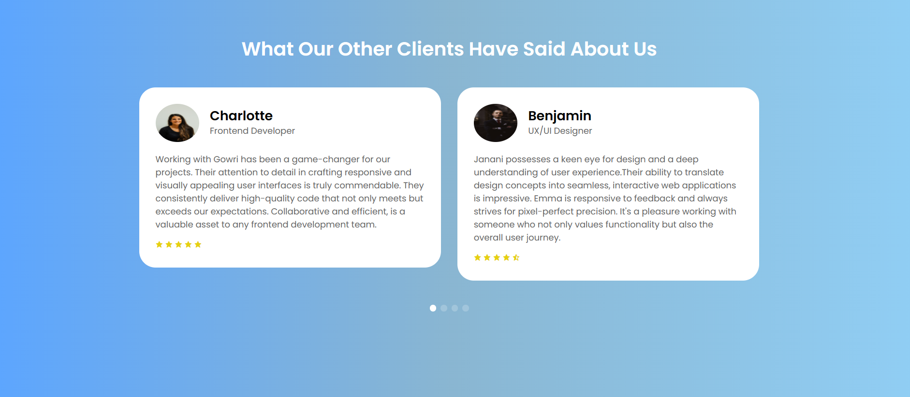

# Testimonial
As a seasoned frontend developer, I recently spearheaded the creation of a dynamic and visually engaging testimonial webpage, showcasing my proficiency in HTML, CSS, and Swiper.js.

Key Contributions :
HTML and CSS Mastery: Leveraging my in-depth knowledge of HTML and CSS, I meticulously crafted a well-structured and responsive webpage. The design not only adheres to the latest industry standards but also ensures an optimal user experience across various devices.

Swiper.js Integration: To enhance the user interaction and provide a seamless testimonial browsing experience, I implemented Swiper.js. This powerful JavaScript library allowed for the effortless integration of a touch-enabled slider, enabling users to effortlessly navigate through testimonials with a swipe gesture.

Visually Appealing Design: My keen eye for design aesthetics played a crucial role in creating a visually appealing layout. The testimonials are presented in a modern and intuitive format, maximizing the impact of positive feedback and endorsements.

Performance Optimization: Recognizing the importance of performance, I optimized the webpage to ensure swift loading times and smooth transitions. This attention to detail contributes to a positive user experience and aligns with best practices in frontend development.

Outcome:

The testimonial webpage has received positive feedback for its intuitive design and seamless navigation. Users can effortlessly explore and engage with testimonials, fostering a sense of trust and credibility. This project showcases my commitment to delivering high-quality frontend solutions that not only meet but exceed user expectations.

Next Steps:

I am enthusiastic about applying my frontend development expertise to future projects, incorporating innovative technologies and design principles to create compelling digital experiences.